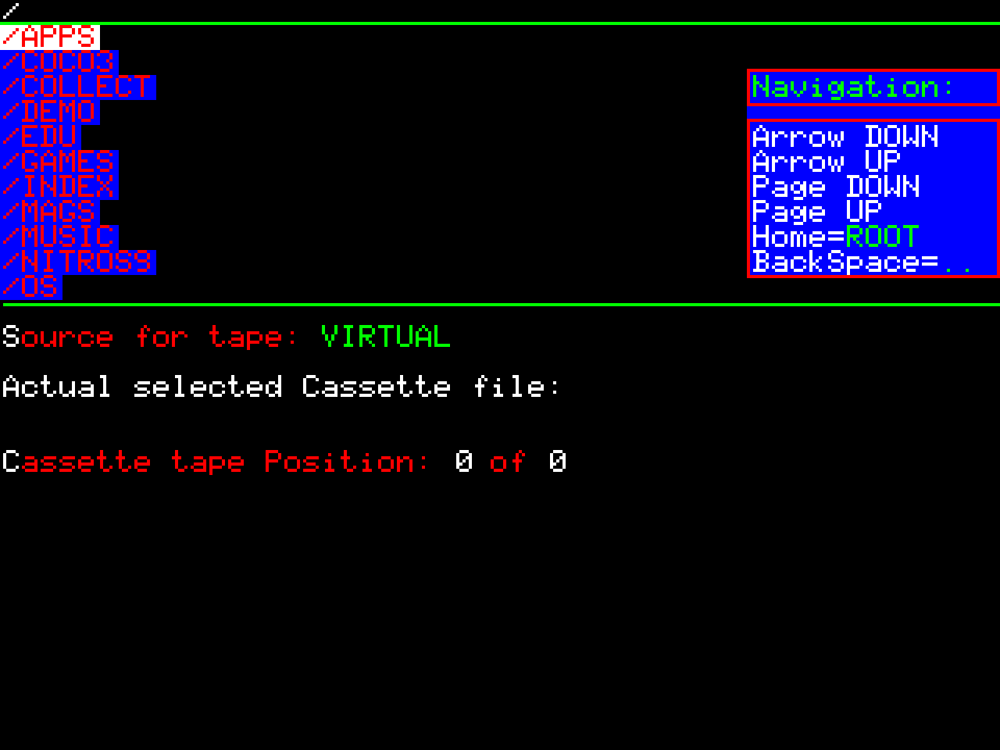
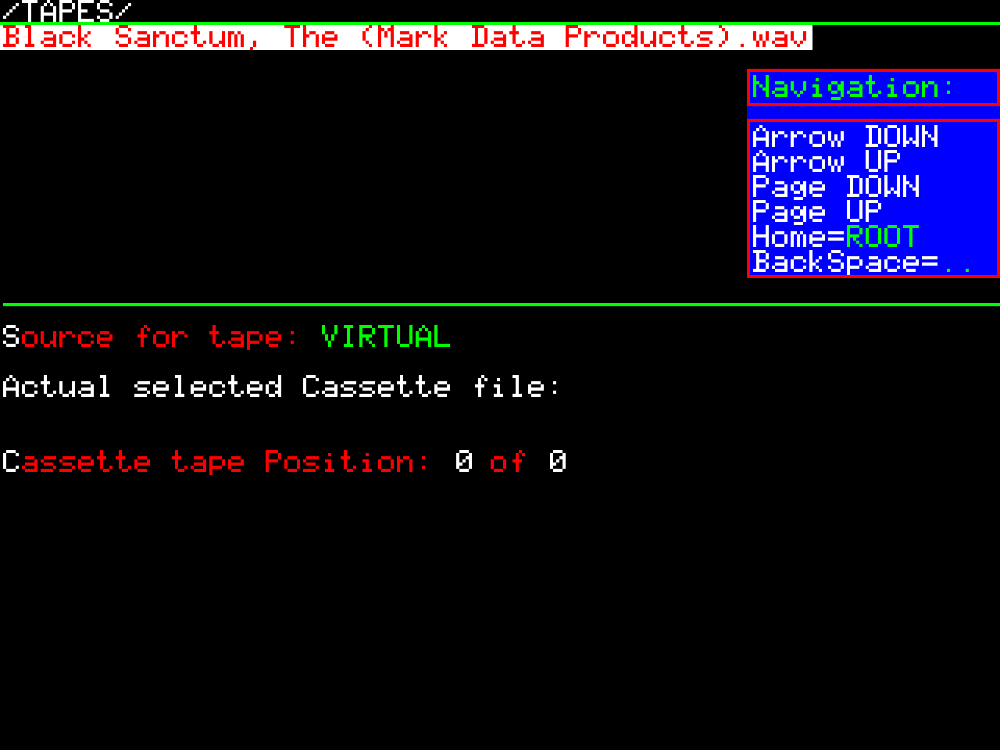
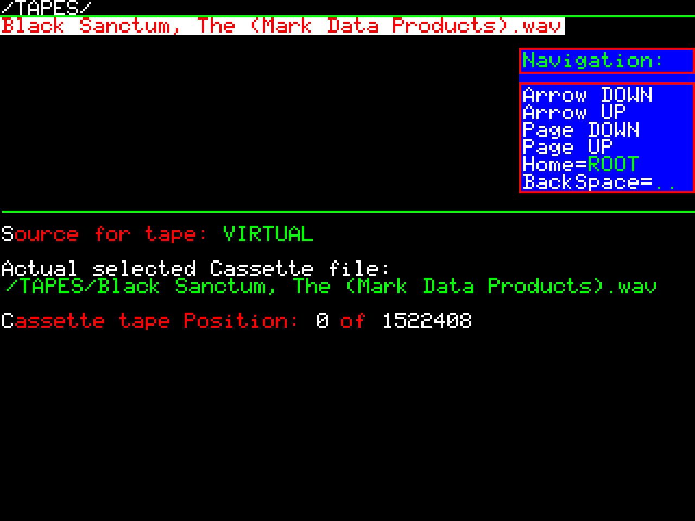
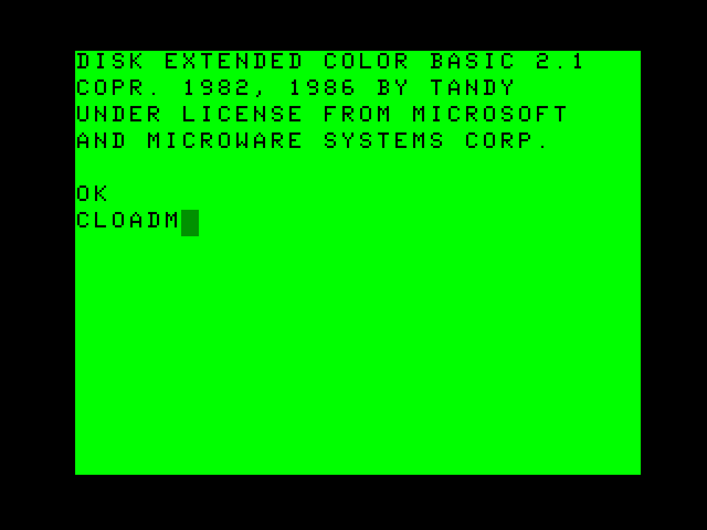
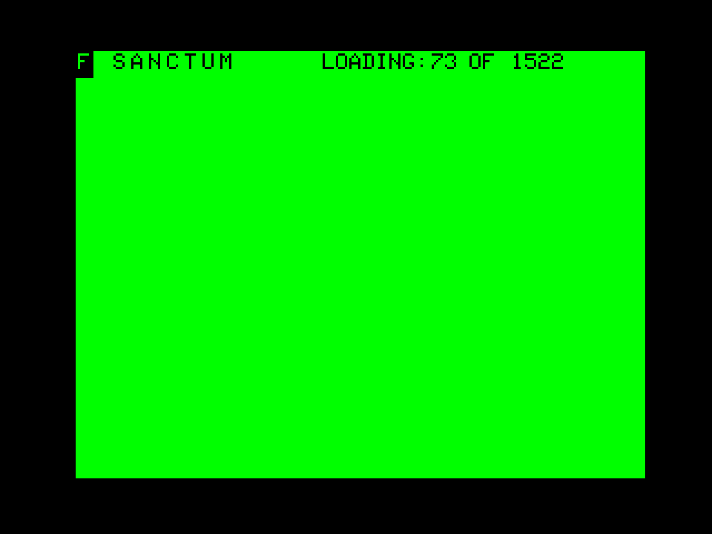

# Cassette Menu

> TODO: verify every step below against actual device behavior.

## Background

The original CoCo loaded programs from cassette tape as audio-encoded data. Emulators typically substitute `.CAS` files (raw bitstream) or `.WAV` files (actual audio recording of the cassette signal) played back to the emulated cassette input.

ESP32-COCO supports two tape sources, toggled with **S** in the Cassette menu:

- **VIRTUAL** — plays (and can save to) a `.WAV` file from the SD card, as described below. **Virtual saving is unreliable** — see [Recording / saving to cassette](#recording--saving-to-cassette).
- **EXTERNAL** — passes through to the physical **CAS** jack (see [hardware-specs.md](../01-getting-started/hardware-specs.md)), for loading and saving with a real cassette deck exactly like an original CoCo. In this mode, `CLOAD`/`CLOADM`/`CSAVE`/`CSAVEM` trigger the **CTL** (relay) jack to start the tape playing, same as real hardware.

> The CoCo ROM here has been patched to show **actual loading progress** — a real CoCo doesn't do this.

## File formats supported

- **`.WAV` only.** `.CAS` is **not yet supported** for mounting cassette tapes.
- **Required WAV format: 9600 Hz, mono, 8 bits per sample.**
- Have a `.CAS` file? Convert it to `.WAV` first using [Mike Horgan's CAS-to-WAV converter](../05-resources/utilities.md) before loading.

## Where to put them

- No fixed folder required — **WAV files can live in any folder** on the SD card.
- Cross-reference: [sd-card.md](../01-getting-started/sd-card.md)

## Loading a program from virtual cassette

1. Open the **F12** menu and go to the **Cassette menu** (shortcut **C** — see [menu-navigation.md](menu-navigation.md)). **Only one cassette can be mounted at a time** — unlike the disk drive menu, there are no multiple cassette slots. Before anything is selected, the menu shows the tape source, the (blank) selected file, and a tape position of `0 of 0`.

   

2. Selecting opens the same SD card file browser used by the Disk menu. Navigate into the folder containing your `.WAV` file(s):

   

3. Once selected, the Cassette menu shows the mounted file's full path and its total tape position (in bytes):

   

4. The loaded cassette does **not persist across a device reset/reboot** — after exiting the menu, issue `CLOAD` (BASIC) or `CLOADM` (machine-language) right away, since you'll need to re-mount the WAV file after any reset. This is plain DECB, not a device-specific command — it's included here purely as a quick reference:

   

5. While loading, the screen shows a progress readout (block count) — this is a ROM patch specific to this device; a real CoCo doesn't show loading progress:

   

## Loading/saving from a real/external tape deck

Press **S** in the Cassette menu to switch the source to **EXTERNAL**. This routes the physical **CAS** jack straight through, so a real cassette deck can be used instead of a `.WAV` file — just like on an original CoCo. `CLOAD`/`CLOADM`/`CSAVE`/`CSAVEM` trigger the **CTL** (relay) jack to start the tape automatically.

The **CAS** jack is bidirectional (in and out on the same jack), unlike a real tape deck's separate mono in/out jacks — connecting one requires a **1/8" stereo-to-mono Y-splitter cable**. See [hardware-specs.md](../01-getting-started/hardware-specs.md).

## Recording / saving to cassette

- `CSAVE` (BASIC) and `CSAVEM` (machine-language) work with both tape sources.
- **Saving to a virtual `.WAV` file (VIRTUAL source) is unreliable** — for reliable saves, use **EXTERNAL** with a real tape deck.

## Where to find CAS/WAV files

- See [media-library.md](../05-resources/media-library.md)
- The [TRS-80 Color Computer Archive](https://colorcomputerarchive.com/) is the go-to source for compatible DSK and WAV files.
- See [utilities.md](../05-resources/utilities.md) for [Mike Horgan's CAS-to-WAV converter](https://gigajunky.github.io/coco/index.html).
