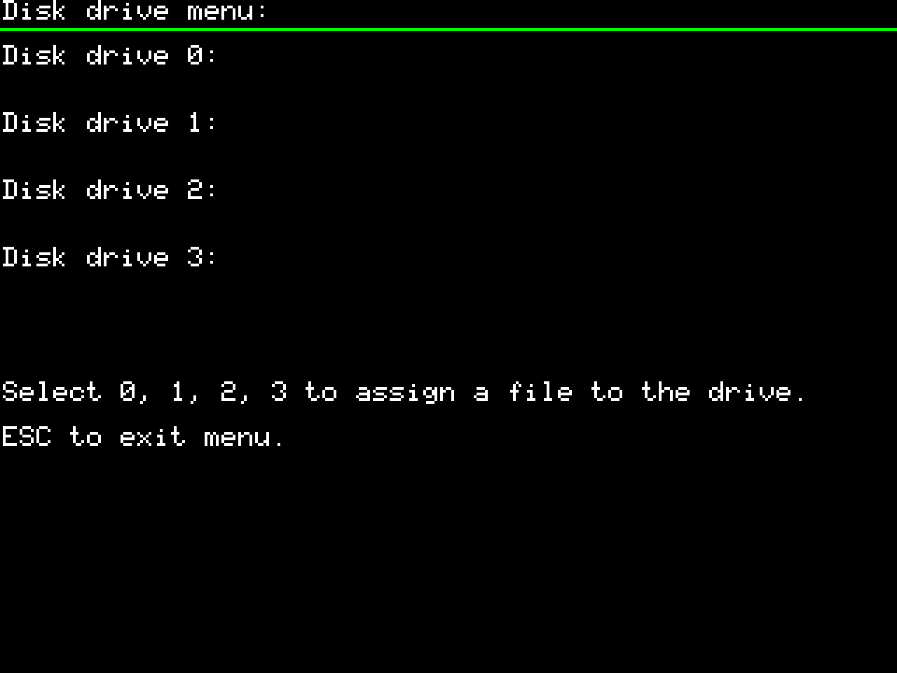
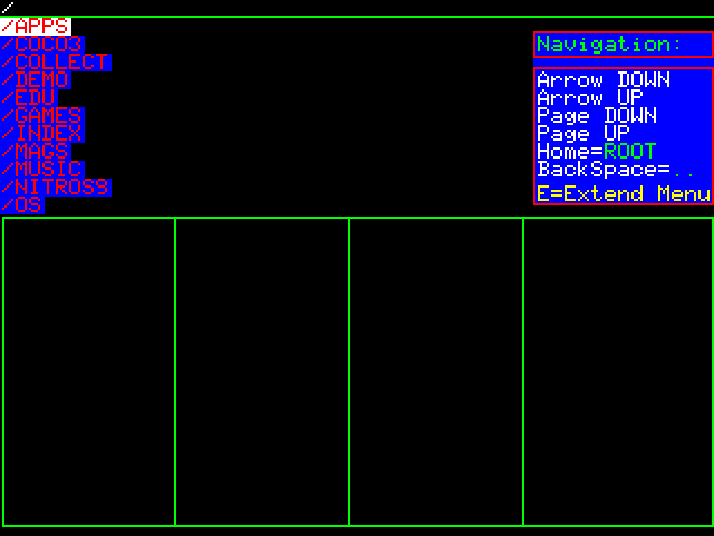
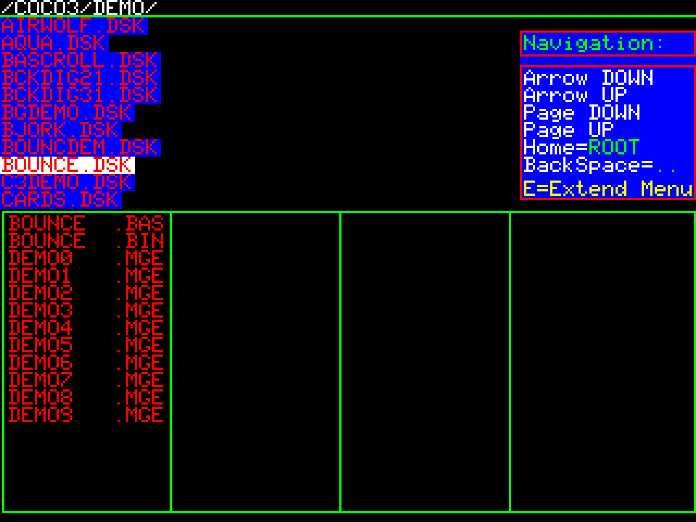
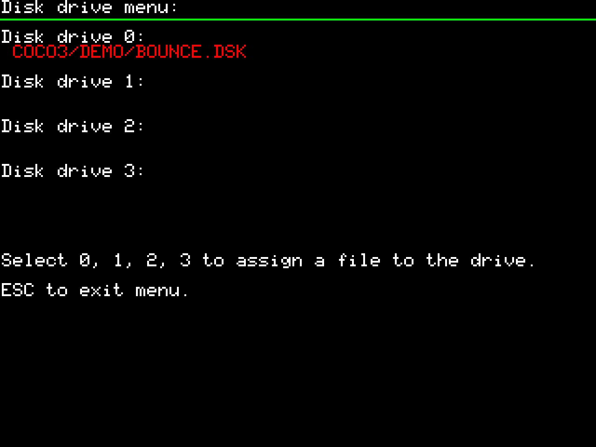
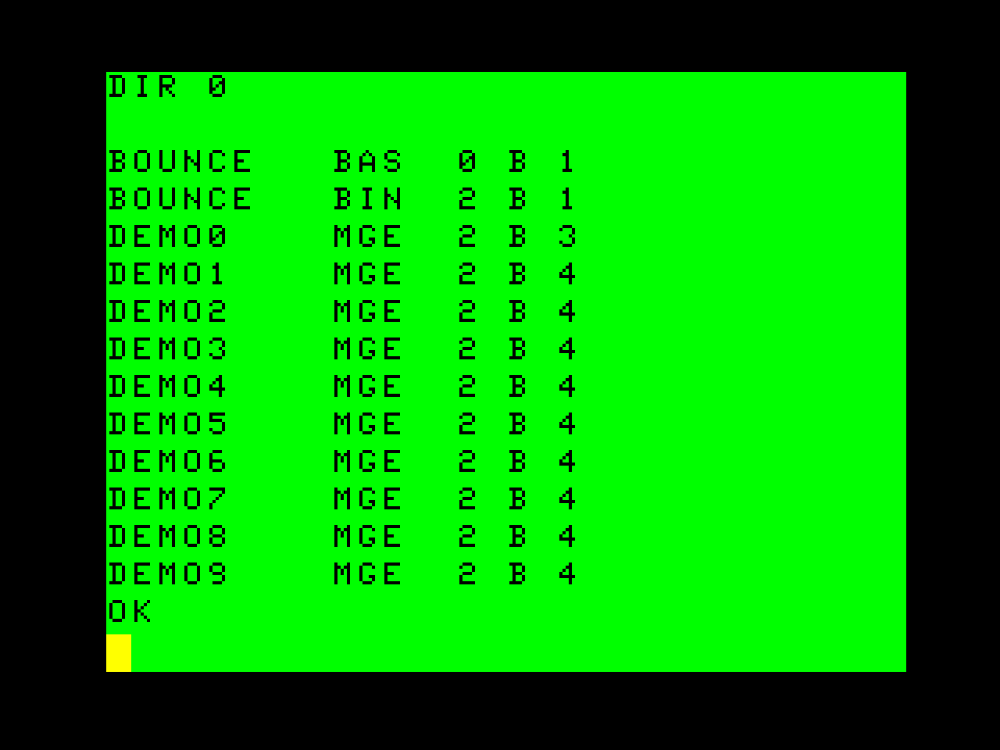
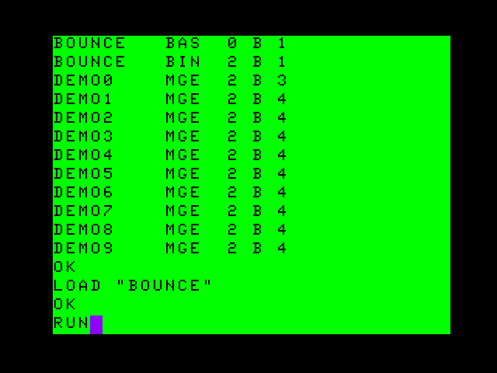

# Disk Menu

> TODO: verify every step below against actual device behavior.

## What DSK files are

`.DSK` files are raw sector-image dumps of TRS-80 CoCo floppy disks (typically 35 or 40 track, single-sided). They're the standard way CoCo software is distributed and preserved today.

## Where to put them

- No fixed folder required — **`.DSK` files can live in any folder** on the SD card. See [sd-card.md](../01-getting-started/sd-card.md) for naming/organization notes.

## Mounting a disk image

1. Open the **F12** menu and go to the **Disk drive menu** (shortcut **D** — see [menu-navigation.md](menu-navigation.md)). Up to 4 virtual drives (0–3) are listed, each showing the file currently assigned (or blank if empty). Select **0, 1, 2, or 3** to assign a file to that drive; **ESC** exits the menu.

   

2. Selecting a drive number opens the SD card file browser. Navigate with **Arrow UP/DOWN**, **Page UP/DOWN**, **Home** (jump to root), and **BackSpace** (up one level); **E** opens the Extended menu, which lets you create a new, formatted `.DSK` file or format the currently-selected `.DSK` — see [Creating & formatting disk images](#creating--formatting-disk-images-firmware-v104) below.

   

3. Browse into a folder containing `.DSK` files. Highlighting a `.DSK` file previews its contents (the files inside that disk image) in the panel below — handy for confirming you've got the right disk before mounting it.

   

4. Once selected, the Disk drive menu shows the mounted image's path under that drive number.

   

5. Press **DEL** to remove/eject a mounted disk from a drive (firmware V1.04+). See [keyboard-shortcuts.md](keyboard-shortcuts.md).

## Creating & formatting disk images (firmware V1.04+)

- Both creating a new `.DSK` and formatting an existing one are done from the **Extended menu** (press **E** in the SD card file browser reached from the Disk drive menu — see [Mounting a disk image](#mounting-a-disk-image) above).
- These options exist because the emulated **`DSKINI`** BASIC command is not functional — formatting a disk from BASIC doesn't work, so the on-device menu is the way to format disks.
- Produces standard CoCo `.DSK` images: **35 tracks, single-sided, single-density RDOS**, roughly **160 KB** of storage.

## Booting from a DSK image

The device doesn't auto-boot a mounted disk — once it's mounted to a drive, you load and run it with standard DECB (Disk Extended Color BASIC) commands, exactly as you would on real hardware. There's nothing ESP32-COCO-specific here; it's included below purely as a quick reference.

1. List the mounted disk's contents with `DIR` (optionally followed by the drive number, e.g. `DIR 0`):

   

2. Load and run a BASIC program with `LOAD "FILENAME"` followed by `RUN`:

   

## Write support

- Write support is confirmed: firmware V1.0.2 specifically fixed a **file corruption issue when saving to disk**, implying write support existed pre-V1.0.2 and is more reliable as of that version. See [firmware-changelog.md](../04-management/firmware-changelog.md).

## Where to find DSK images

- See [media-library.md](../05-resources/media-library.md)
- The [TRS-80 Color Computer Archive](https://colorcomputerarchive.com/) is the go-to source for compatible DSK and WAV files.
- A joystick-testing `.DSK` from the creator is available — see [media-library.md](../05-resources/media-library.md).
- See [utilities.md](../05-resources/utilities.md) for the Coco File Image Utility (disk manipulation, FujiNet downloads, OS-9 formatting, and more).
