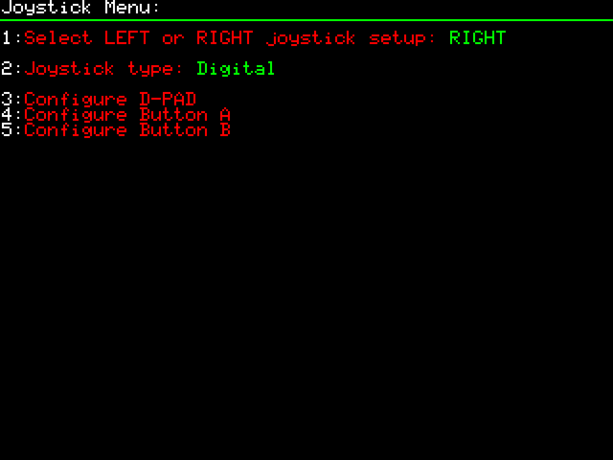
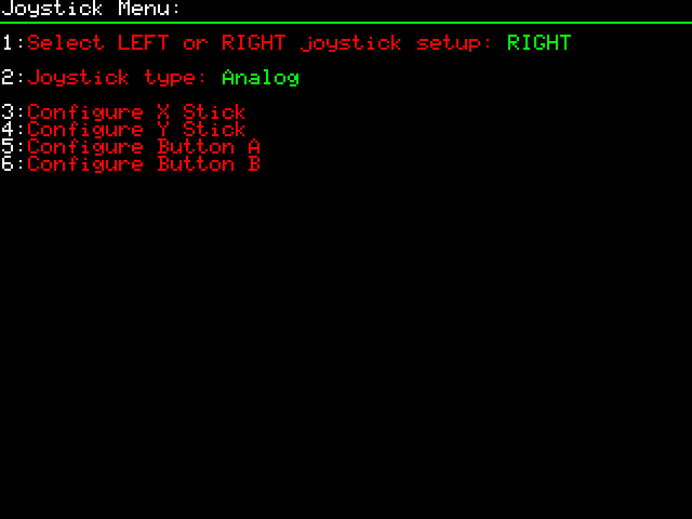
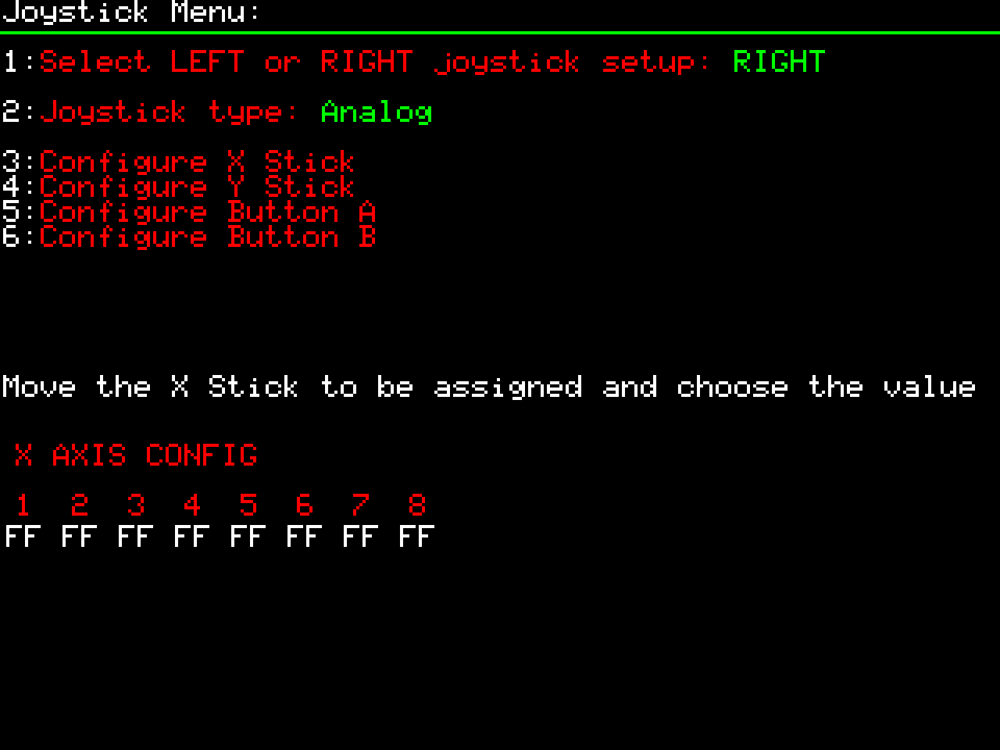
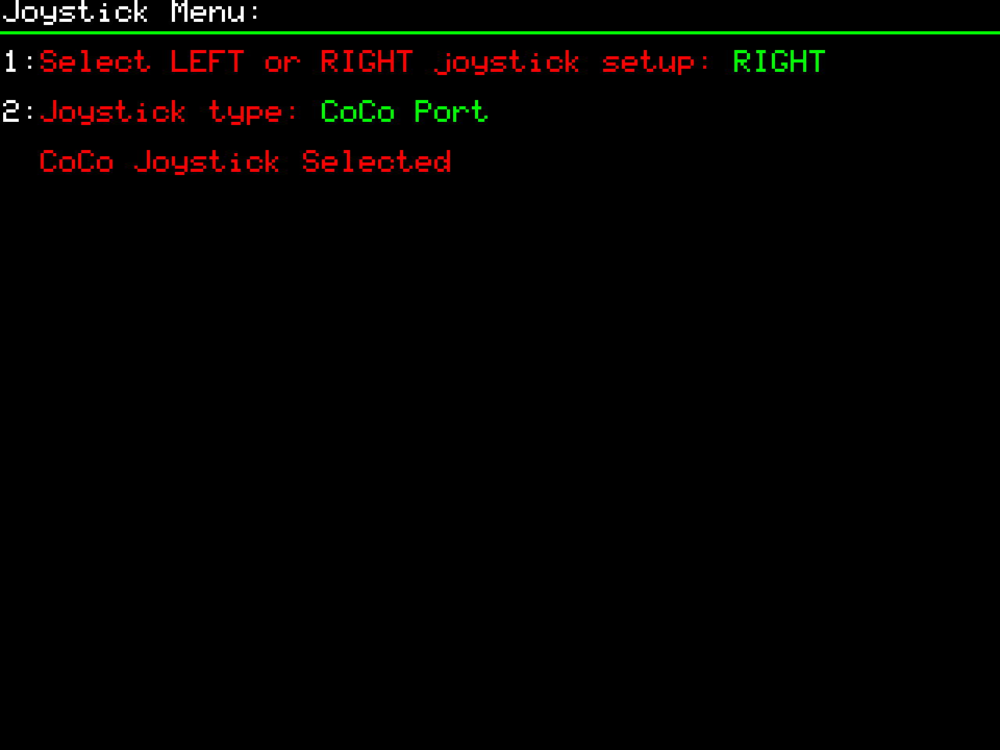

# Joystick Menu

## Opening the menu

- From the **F12** menu, press **J** for the Joystick menu — see [menu-navigation.md](menu-navigation.md).

## Selecting which port you're configuring

- **Item 1 — Select LEFT or RIGHT joystick setup**: chooses which of the two USB joystick ports you're configuring, mirroring the original CoCo's "left/right joystick" terminology. Each port (Left, Right) has its own independent type and button/axis configuration — set up one, then switch item 1 to the other port and repeat if you're using two controllers.

## Joystick type

- **Item 2 — Joystick type**: cycles between **Digital**, **Analog**, and **CoCo Port**. The remaining menu items change depending on which type is selected.

### Digital

- **3 — Configure D-PAD**: press **3**, then hit any direction on the D-pad to assign it.
- **4 — Configure Button A**: press **4**, then click the physical button you want mapped to A.
- **5 — Configure Button B**: press **5**, then click the physical button you want mapped to B.

### Analog

- **3 — Configure X Stick**: press **3**. The screen prompts "Move the X Stick to be assigned and choose the value" and shows 8 axis slots (1–8, all `FF` until set). Move the stick **left/right** and watch which of the 8 values changes — that's your X axis. Click the matching number to assign it.

  

- **4 — Configure Y Stick**: press **4**, same process but move the stick **up/down** to find the matching axis number, then click it.
- **5 — Configure Button A**: press **5**, then click the physical button you want mapped to A.
- **6 — Configure Button B**: press **6**, then click the physical button you want mapped to B.

> This is the step people most often get wrong: for X/Y axes you must select the matching **axis number**, not just wiggle the stick and expect it to auto-assign.

### CoCo Port

- The native CoCo joystick option, for use with the optional CoCo joystick expansion module connected to the side expansion port (see [hardware-specs.md](../01-getting-started/hardware-specs.md)). Selecting it shows "CoCo Joystick Selected" with no further sub-configuration — it's meant to be plug-and-play.

## Related tools

- A [Joystick Config Editor by Mike Horgan](../05-resources/utilities.md) is available to help set up a controller once connected.
- A [joystick testing .DSK image](../05-resources/media-library.md) from the creator is available to verify a controller works correctly.

## See also

- [Joysticks & Controllers](../03-compatible-hardware/joysticks-and-controllers.md) — hardware compatibility, known-working controllers, connector/port info
