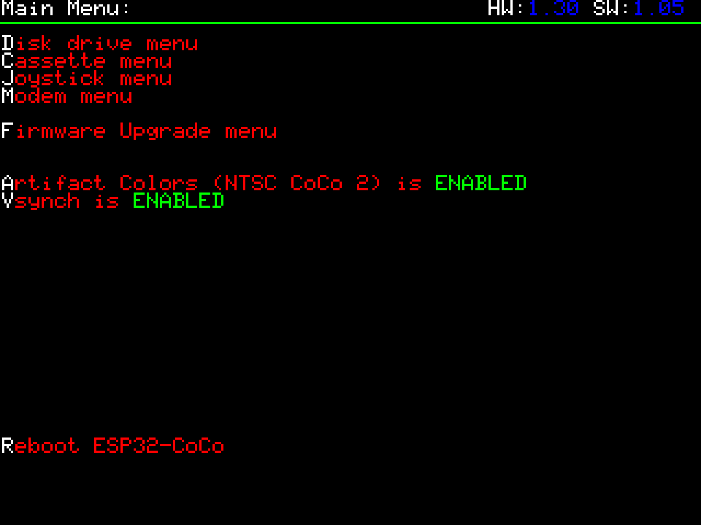

# Menu Navigation

## Opening the menu

- Press **F12** to open the on-screen menu — see [keyboard-shortcuts.md](keyboard-shortcuts.md).

## Menu structure

The top-right corner shows the board's hardware and software revision (`HW:` / `SW:`, firmware V1.04+ — see [firmware-changelog.md](../04-management/firmware-changelog.md)). Each item's first letter is highlighted (white vs. red) to show it's also its keyboard shortcut.

The F12 menu contains:

| Item                              | Shortcut key | Purpose                                                                                                                                |
| --------------------------------- | ------------ | -------------------------------------------------------------------------------------------------------------------------------------- |
| **Disk drive menu**               | **D**        | Load up to 4 disk images (drives 0–3) — see [disk-menu.md](disk-menu.md)                               |
| **Cassette menu**                 | **C**        | Load a single WAV file — see [cassette-menu.md](cassette-menu.md)                                        |
| **Joystick menu**                 | **J**        | Configure connected joysticks/controllers — see [joystick-menu.md](joystick-menu.md) |
| **Modem menu**                    | **M**        | WiFi/Telnet BBS bridge status and configuration — see [modem-menu.md](modem-menu.md)                      |
| **Firmware Upgrade menu**         | **F**        | Flash new firmware from a file on the SD card — see [firmware-upgrade-menu.md](firmware-upgrade-menu.md)                        |
| **Artifact Colors (NTSC CoCo 2)** | **A**        | ENABLED / DISABLED — simulates the fake artifact colors a CoCo 2 would produce on an NTSC TV                                           |
| **Vsync**                         | **V**        | ENABLED / DISABLED                                                                                                                     |
| **Reboot ESP32-CoCo**             | **R**        | Restarts the device                                                                                                                    |

- Within the F12 menu, each item can be jumped to directly by pressing the **first letter of its name** on the keyboard (D, C, J, M, F, A, V, R — see table above).
- Screenshots of each sub-menu are on their respective pages: [Disk Menu](disk-menu.md), [Cassette Menu](cassette-menu.md), [Joystick Menu](joystick-menu.md), [Modem Menu](modem-menu.md).

## Common tasks from the menu

- Load a disk or cassette image — see [Disk Menu](disk-menu.md) and [Cassette Menu](cassette-menu.md)
- Check/configure WiFi — see [modem-menu.md](modem-menu.md)
- Flash new firmware — see [firmware-upgrade-menu.md](firmware-upgrade-menu.md)
- Toggle artifact colors or Vsync — see [Features](../01-getting-started/features.md)

## Settings storage

- **There is no separate, user-editable config file.** All settings are changed via the on-device menus above.
- Settings are saved to a visible file at the **root of the SD card** (referenced elsewhere as `config.ccc` — see [modem-menu.md](modem-menu.md)), but it's a **non-editable binary dump**, not a text/INI/JSON file you can hand-edit.
- To reset a bad configuration, delete that file from the SD card root and reconfigure via the menu.