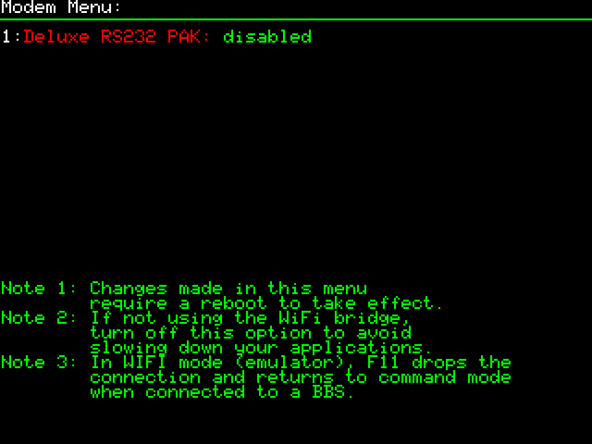
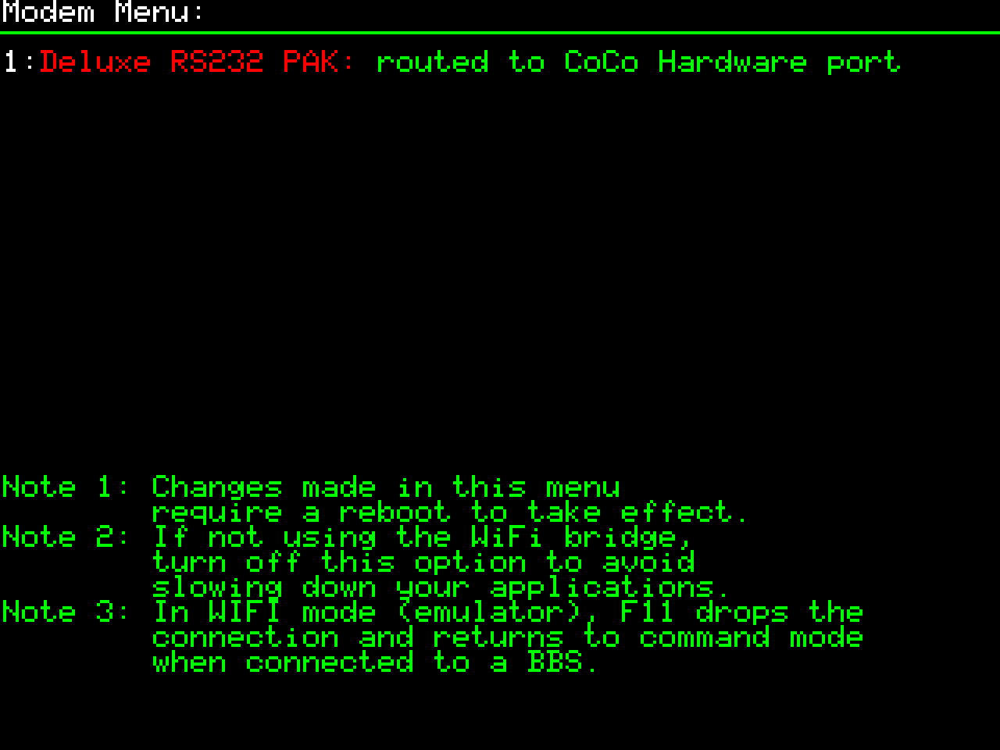
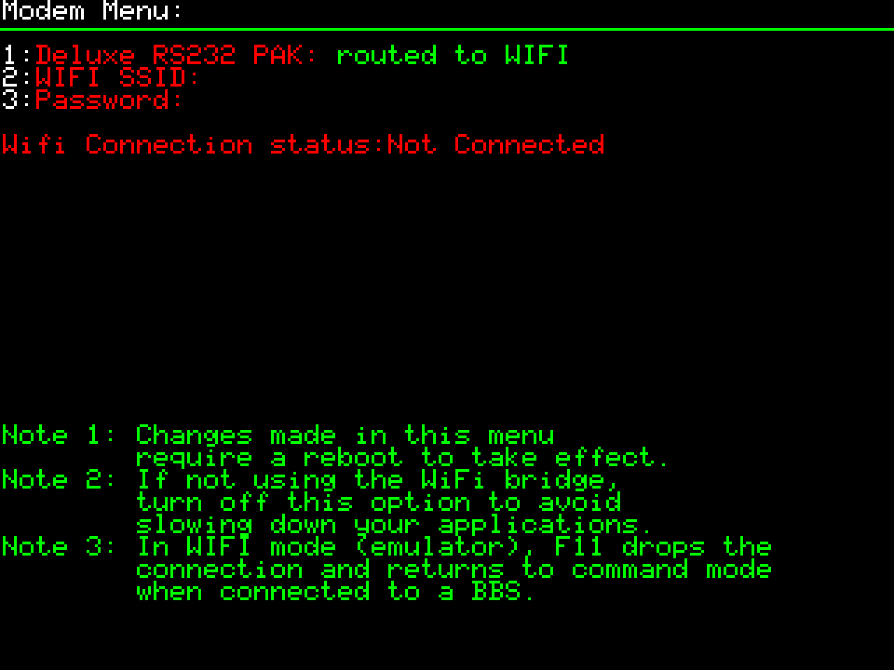
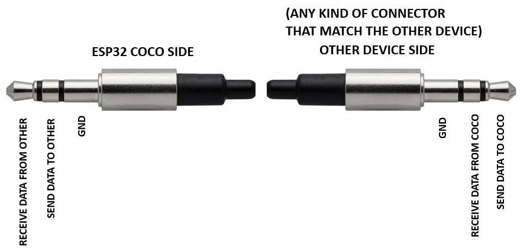
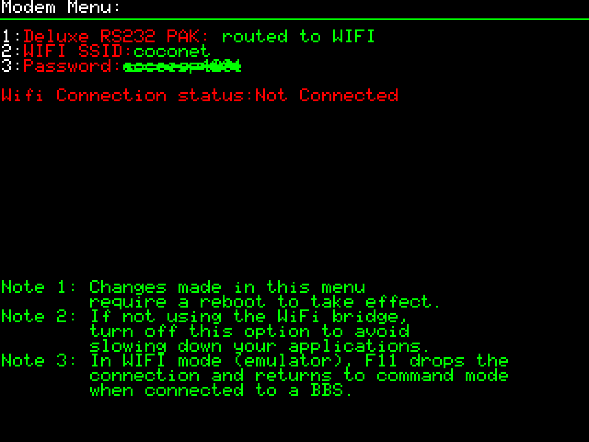
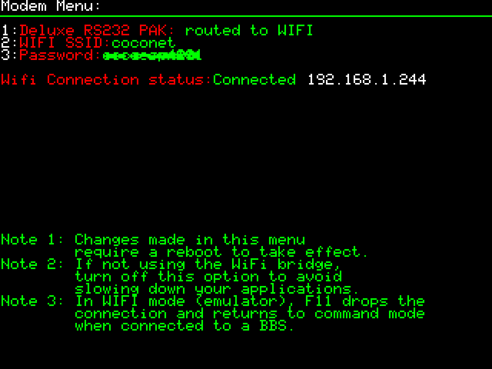

# Modem Menu

> Introduced in firmware V1.0.2 (board rev V1.2). See [firmware-changelog.md](../04-management/firmware-changelog.md). Configures the single serial port (3.5mm jack — see [hardware-specs.md](../01-getting-started/hardware-specs.md)), which can be routed to either the RS-232 PAK hardware serial mode or the WiFi/Telnet bridge — see [RS-232 PAK routing](#rs-232-pak-routing) below.
>
> **The WiFi bridge is experimental and can be finicky.** Following the setup order below (Twi-Term settings first, then WiFi, then launch Twi-Term) minimizes instability. See [Known instability](#known-instability) for caveats.

## Opening the menu

- From the **F12** menu, press **M** for the Modem menu — see [menu-navigation.md](menu-navigation.md).

## RS-232 PAK routing

**Item 1** cycles the serial port through three states:

- **disabled**
- **routed to CoCo Hardware port** — the port works like a real RS-232 Program Pak's serial port, for connecting two CoCos, or a CoCo and a PC, directly.
- **routed to WIFI** — bridges the port over WiFi to Telnet, so CoCo terminal software can dial into Telnet BBSes as if using a modem.

| State | Screenshot |
|---|---|
| Disabled |  |
| Routed to CoCo Hardware port |  |
| Routed to WIFI |  |

**If you're not using the WiFi bridge, set this to disabled** — leaving it routed to WIFI slows down applications even when nothing is connected (see Note 2 in the menu itself, visible in the screenshots above).

Changes made in this menu require a **reboot** to take effect.

## Making a serial cable (CoCo Hardware port mode)

To use the **routed to CoCo Hardware port** mode (connecting two CoCos, or a CoCo and a PC, directly via the serial jack), you'll need to build your own cable — a 1/8" (3.5mm) TRS plug on the ESP32-COCO end, wired to whatever connector matches the other device.



- **ESP32-COCO side (1/8" TRS plug)**: Tip = Receive Data From Other, Ring = Send Data To Other, Sleeve = GND.
- **Other device side**: whatever connector matches that device, wired so its Send line reaches the CoCo's Receive line and vice versa (i.e. crossed, like a null-modem), with GND connected straight through.

See [hardware-specs.md](../01-getting-started/hardware-specs.md) for the serial port's physical description, and [media-library.md](../05-resources/media-library.md) for a `.DSK` image to test serial capabilities once your cable's wired up.

## Connecting to a Telnet BBS via WiFi

This is the full, tested sequence for minimizing instability. Do the steps in this order — configuring things out of order is a common source of failures.

### 1. Prepare Twi-Term's settings

1. Open the **F12** menu.
2. Go to the Disk menu and load the Twi-Term `.DSK` image into drive slot 0 — see [Disk Menu](disk-menu.md).
3. `LOADM"TWI-TERM"`
4. `EXEC`
5. **ESC** to dismiss the splash screen popup.
6. **F1+O** to open the Options menu.
7. Hit **R** for RS232c settings.
8. Hit **R** again for RS232 type, and switch it to **Tandy**.
9. Hit **B** to cycle Baud rate until it reads **19200**.
10. Hit **ESC** to return to Default Parameters.
11. Hit **S** to save the settings permanently.

### 2. Prepare the WiFi connection

1. Hit **F12** for the menu.
2. Hit **M** for the Modem menu.
3. Hit **1** until it reads **"routed to WIFI"**.
4. Hit **2** and set the **WiFi SSID**.
5. Hit **3** and enter the **password**.

   

6. **ESC** to return to the main menu.
7. Hit **R** to reset.
8. This might take several attempts and restarts. At each restart, hit **F12** then **M** to check connection status. If it says "Not Connected," restart again until it shows **"Connected"** with an IP address assigned by your router:

   

9. **ESC** to exit the menu.

> **Always confirm the WiFi connection is established (via F12 → M) before starting Twi-Term** — especially right after a restart.

#### WiFi network recommendation

CoCo keyboard input has poor special-character support, so:

- Set up a dedicated **guest WiFi network** on your router, on **2.4GHz**.
- Keep the **SSID and password short and simple** — no special characters the CoCo can't type. Still keep the password reasonably secure, just simple to type.
- Tested working configuration: **2.4GHz, WPA2-Personal**.

> Typing tip: on-device text entry is uppercase by default. Hold **LEFT SHIFT** to type lowercase characters (e.g. for a mixed-case password).

### 3. Start Twi-Term and dial the BBS

1. `LOADM"TWI-TERM"`
2. `EXEC`
3. **ESC** to dismiss the popup.
4. If everything's correct, you'll see an **AT** prompt at the bottom — that confirms the serial link is established.
5. Type `ATDT` followed by the BBS hostname, e.g.:

   ```
   ATDT bwrbbs.ddns.net
   ```

6. You should now be connected to the BBS.

### Demo

- Cedric (creator) running Twi-Term connected to a Telnet BBS: https://www.youtube.com/watch?v=TRWprAEIpag

## Known instability

- The WiFi bridge firmware is still experimental and can be unstable.
- It often causes **keyboard disconnections**. Usually reconnecting the keyboard fixes it, but it can also trigger a full device restart.
- If the device restarts for any reason, re-verify the WiFi connection (F12 → M) before relaunching Twi-Term.

## Exiting a connection

- Press **F11** to drop the connection and return to command mode.

## Compatible terminal software

- **Twilight Terminal (Twi-Term)** by Sock Master
- **V-Term** by GimmeSoft

## Related shortcuts

- **F11** — exit data mode, return to command mode (WiFi/Telnet mode only)
- **F1+O** — an option inside Twi-Term's own main menu (used above to reach RS232c settings), not a device-wide shortcut, and not how you launch Twi-Term itself

See also: [keyboard-shortcuts.md](keyboard-shortcuts.md)
