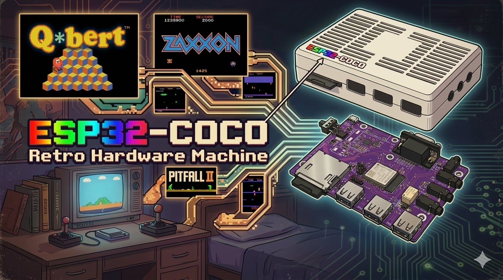
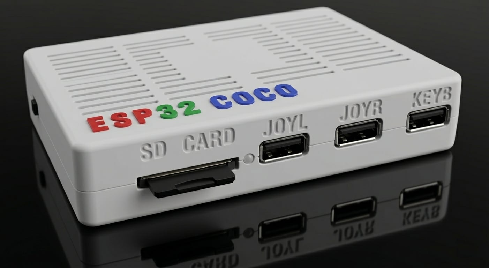

# ESP32-COCO Documentation

Community documentation for the **ESP32-COCO**, a bare-metal hardware emulator for the Tandy/Radio Shack TRS-80 Color Computer 1, 2, and 3, built on ESP32-S3 hardware by Cedric Beaudoin.

**Official home:** https://github.com/mast4rbug/ESP32-CoCo — also the future home for firmware update files and, potentially, source code.

This repository is a community-maintained knowledge base. The device is under active development and had no central docs before this repo. Everything here is sourced from the CoCo community (Facebook group, demo videos, and hands-on testing) and is a work in progress. See [CONTRIBUTING.md](CONTRIBUTING.md) if you want to help fill it in.

## Contents

### [01 · Getting Started](01-getting-started/)
- [Overview](01-getting-started/overview.md) — what ESP32-COCO is, what it emulates
- [Features](01-getting-started/features.md) — feature summary / capability matrix
- [Hardware Specs](01-getting-started/hardware-specs.md) — board, chip, ports, storage
- [Setup & First Boot](01-getting-started/setup-and-first-boot.md) — unboxing to first CoCo prompt
- [SD Card](01-getting-started/sd-card.md) — folder structure, naming, transferring files

### [02 · Menus & Shortcuts](02-menus-and-shortcuts/)
- [Keyboard Shortcuts](02-menus-and-shortcuts/keyboard-shortcuts.md) — full shortcut reference, including CoCo-to-PC key mapping
- [Menu Navigation](02-menus-and-shortcuts/menu-navigation.md) — on-device menu/OSD system
- [Disk Menu](02-menus-and-shortcuts/disk-menu.md) — loading floppy disk images
- [Cassette Menu](02-menus-and-shortcuts/cassette-menu.md) — loading programs via emulated cassette
- [Joystick Menu](02-menus-and-shortcuts/joystick-menu.md) — configuring joystick/controller axes and buttons
- [Modem Menu](02-menus-and-shortcuts/modem-menu.md) — WiFi/Telnet BBS bridge configuration, plus RS-232 PAK hardware serial mode
- [Firmware Upgrade Menu](02-menus-and-shortcuts/firmware-upgrade-menu.md) — updating the ESP32-COCO firmware

### [03 · Compatible Hardware](03-compatible-hardware/)
- [Keyboards](03-compatible-hardware/keyboards.md) — tested/supported keyboards
- [Joysticks & Controllers](03-compatible-hardware/joysticks-and-controllers.md) — analog/digital joystick support
- [Storage Devices](03-compatible-hardware/storage-devices.md) — SD cards, USB storage
- [Cases & Enclosures](03-compatible-hardware/cases-and-enclosures.md) — 3D-printed case options

### [04 · Management](04-management/)
- [Troubleshooting](04-management/troubleshooting.md) — common issues and fixes
- [Backup & Restore](04-management/backup-and-restore.md) — protecting your SD card contents
- [Firmware Changelog](04-management/firmware-changelog.md) — device firmware version history

### [05 · Resources](05-resources/)
- [Media Library](05-resources/media-library.md) — known-working DSK/CAS/ROM titles
- [Video Index](05-resources/video-index.md) — demo videos, tutorials, dev logs
- [Utilities](05-resources/utilities.md) — tools for building/converting DSK, WAV, ROM files
- [Community Links](05-resources/community-links.md) — where to find help and updates

### Other
- [Glossary](glossary.md)
- [Changelog](CHANGELOG.md)
- [Contributing](CONTRIBUTING.md)

## What is the ESP32-COCO?

The ESP32-COCO is a low-cost hardware emulator that reproduces a TRS-80 Color Computer 3 on ESP32-S3 hardware — backward compatible with CoCo 1 and CoCo 2 software — aiming to run original CoCo software and games without original Tandy hardware. It is an actively developed, community-driven project — details in this repo will be updated as the device and firmware evolve.

*Last updated: 2026-07-08*
